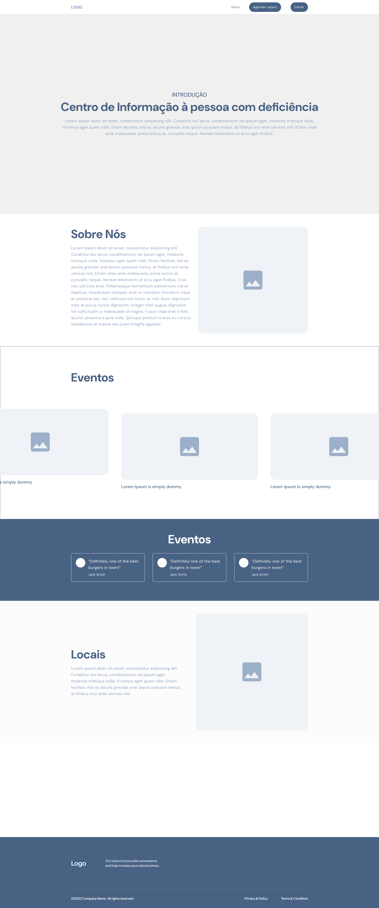

# Projeto Extensionista - Sistema de gerenciamento para o Centro de Informação à pessoa com deficiência(CIPD)
Integrantes:
- Pedro Lucas Câmara Rodrigues Lopes - 10753510
- Luana de Paiva Brito - 10750121
- Louisy Dalchiavon Tomazi - 10755895
- Murilo Arevalo - 10743851
- Victor Pereira - 10755205

# Ideação
A ideia do nosso projeto veio pela denúncia de uma das integrantes do grupo frente a falta de divulgação de um importantíssimo projeto do governo, o "Centro de Informação à pessoa com deficiência". O projeto busca divulgar a existência do projeto, ampliar sua relevância e auxiliar os profissionais envolvidos em tarefas administrativas, como na coleta e preenchimento eletrônico de formulários para requisitar o serviço de manutenção de aparelhos fornecido pelo projeto. 
Para resolver estes problemas, o projeto será composto por:
- Uma landing page introdutória, com visual moderno e acessível
- Uma página de formulário para o agendamento dos consertos
- Uma visualização em calendário, com status de aceitação e dados informados, para os consertos agendados (visando acesso administrativo apenas)

O caráter extensionista tem o objetivo de atingir a comunidade de pessoas com deficiência (cegos/baixa visão e pessoas com restrição de mobilidade, principalmente), pois o conhecimento dessa Central de Informação é muito raro, geralmente apenas funcionários do metrô das estações Santa Cruz, Tatuapé e Barra Funda divulgam essas informações oralmente. Além do desconhecimento desse auxílio do governo, as pessoas que o conhecem não possuem acesso aos dias de funcionamento do recurso, o que resulta em viagens perdidas ou necessidade de deslocamento a uma rota completamente diferente do caminho planejado pela pessoa.
Visto a dificuldade de locomoção dessas pessoas, a falta dessas informações e de facilidade de comunicação com esses serviços acaba se tornando um empencílio à essa comunidade. A proposta se torna parte do nosso cotidiano por um dos integrantes trabalhar na operação da estação de metrô "Santa Cruz", tendo contato com o público todos os dias.

# Borboleta
Para esta etapa, iremos continuar com o Projeto Lagarta do site "Centro de Informação à Pessoa com Deficiência". 
Nessa nova versão, removemos a seção de Galeria, pois pensamos que com o novo design da seção "Eventos" teriamos 2 seções semelhantes no site. 
No protótipo, vamos manter o estilo e design do wireframe anterior e acrescentaremos uma rota dinâmica na seção "Eventos".

# Tutorial do Código
A tela Home tem como finalidade apresentar informações institucionais sobre o CIPD. Nessa interface, são disponibilizados conteúdos relacionados aos objetivos da instituição, aos eventos realizados, aos feedbacks de clientes e às localidades presenciais do centro.

Na parte superior da tela, encontra-se um menu de navegação que permite ao usuário acessar diferentes funcionalidades do sistema. Entre elas, destaca-se a tela de agendamento de reparos, destinada aos clientes que necessitam de manutenção em seus equipamentos de apoio, e a tela de login, voltada exclusivamente aos funcionários, possibilitando o acesso ao calendário de agendamentos disponíveis para o mês.

---

## Rota Simples
Na rota simples, temos um menu de navegação(Foto 1) com botão de "Agendar Reparo", que assim que clicada irá redirecionar o usuário para o formulário onde o mesmo poderá fazer o agendamento do seu reparo. (Foto 2)


## Rota Dinâmica

Como rota dinâmica, iremos fazer uma seção de Eventos reimaginada, com fotos representando cada evento na página inicial em formato de carrossel(Foto 3). Assim que o usuário clicar na foto, uma nova página irá abrir e mostrar as informações completas sobre o evento.(Foto 4)

  
  

## Código

**Home**

- Sobre nós: Na seção “Sobre Nós”, foi adicionado um texto acompanhado de um vídeo informativo sobre o CIPD, proporcionando uma apresentação mais dinâmica e interativa. Na estilização, utilizou-se o Flexbox para alinhar os conteúdos lado a lado, garantindo uma organização visual mais moderna e responsiva.

```html
 <section className="conteudo">
    <section className="texto">...</section>
    <section className="video">...</section>
  </section>
```
```css
.conteudo {
  display: flex;
  justify-content: space-between;
  align-items: flex-start;
  gap: 2rem;
}
```

- Eventos: fizemos modificações nessa seção para que a funcionalidade de apresentação desses eventos ficasse mais compatível com a proposta do site, agora os blocos com os artigos estão em um carrossel para navegação e, quando clicados, abrem em uma nova página configurada com o modelo para esses artigos:


**Agendar reparo e Login**
 - Foi criado com "use cliente", para funcionar no Next.js. Os campos são controlados por useState.
 ```js
 ...
 export default function Agendar() {
    const [name, setName] = useState('')
    const [phone, setPhone] = useState('')
    ...}

 ```
 - No formulário da tela Login, foi utilizado useRouter, que ao submeter o formulário, ele redireciona para outra tela via router.push().
```js
import { useRouter } from "next/navigation";

export default function Login() {
    const [usuario, setUsuario] = useState('')
    const [senha, setSenha] = useState('')
    const router = useRouter();

    function loginColaborador(ev) {
        ev.preventDefault();

        console.log("Usuário:", usuario);
        console.log("Senha:", senha);   

        router.push('/pages/calendario');
    }
```
## API
As features do épico de eventos serão adaptadas ao uso da API
